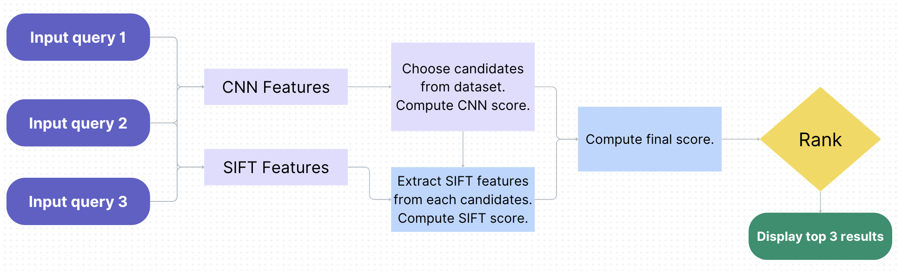
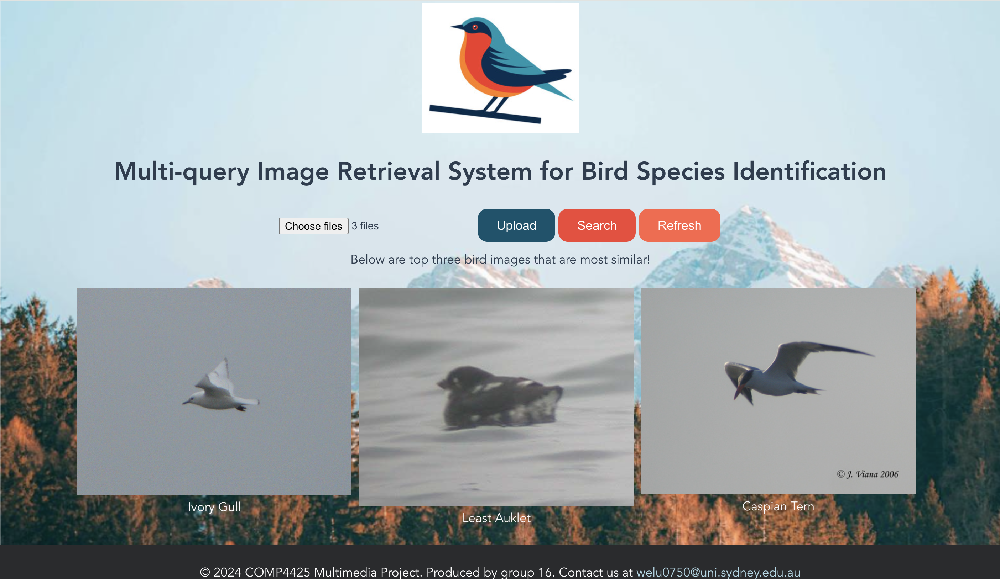

# Multi-Query Content-Based Image Retrieval System for Bird Species Identification
<p align="center">
  
</p>

## 1. Requirements
- This project requires Python>=3.10.0. You can create a conda environment using the following: \
```conda create -n <env_name> python=3.10.9``` \
and use `conda activate <env_name>` to activate your environment. \
**Please replace `<env_name>` with your preferred name for the environment.**

- Next, install Node.js and npm in your environment. You can refer to this [link](https://docs.npmjs.com/downloading-and-installing-node-js-and-npm) for installing npm and Node.js.\
We are using Node version `v16.20.2` and npm version `8.19.4`.\
If you are using MacOS or Linux, you can use Homebrew to install by running the following:\
`brew install node@16` 

- Run `python setup.py` to install the required packages.

## 2. Download dataset
- The dataset is available at [Google Drive](https://drive.google.com/file/d/1dQx1cwO4W0WVYcnzGB1ftxEcwiQaFv90/view?usp=sharing). Note there are many folders and files inside,
  but we only need to use the `CUB_200_2011/images` folder. The hierarchy of the dataset is shown below:
  ```
   ${CUB_200_2011 ROOT}
    -- attributes.txt
    -- CUB_200_2011
        |-- images
        |-- attributes
        ...
   ```
- Put the `images` folder into the project directory as follows:
  ```
   ${Multimedia2024 ROOT}
    -- flask_web
        |-- vue_frontend
            |-- public
                |-- data
                    |-- CUB_200_2011
                        |-- images
    ...
    
   ```
  

## 3. Run the app

<p align="center">
  
</p>

- The app is run on a local MySQL database named `sample_bird` with a single table named `bird_table_2`. The database should have the following architecture:

  ```
    | filename    | features    | id
    | ----------- | ----------- |----
    | filename 1  | features 1  |0
    | filename 2  | features 2  |1
    ...
    | filename n  | features n  |n-1
    
  ```
  You will need to create a empty database yourself on your local machine. Next, you can use the code in the Jupyter Notebook to generate a csv containing the filename and the features. Finally, import the data in the csv file into the database.

- To run the application, direct to `flask-web/vue-frontend`, and run `npm install` in a terminal or PowerShell. \
  After installation, run `npm run serve`. \
  You should see a message that the app is running at the local host. Copy the local URL to a clipboard. You will need it later.
- In a new terminal or PowerShell, direct to `flask-web/backend`. Run `python app.py`. After the server starts successfully, open the URL you copied in your web browser. Now you can see the running web app.
- You can upload up to 5 images at once. After the images are uploaded successfully, click the search button and be patient. **Note that the initial search would take longer as the model needs to be initialized.**
- If you want to start a new search, click on refresh or refresh your browser. This will delete your previously uploaded files.

